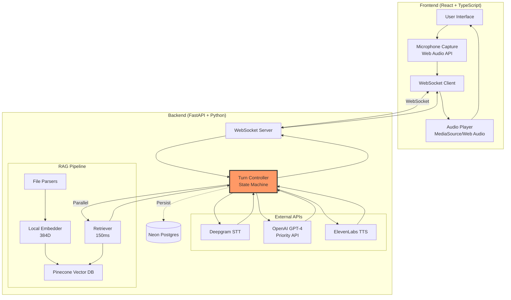
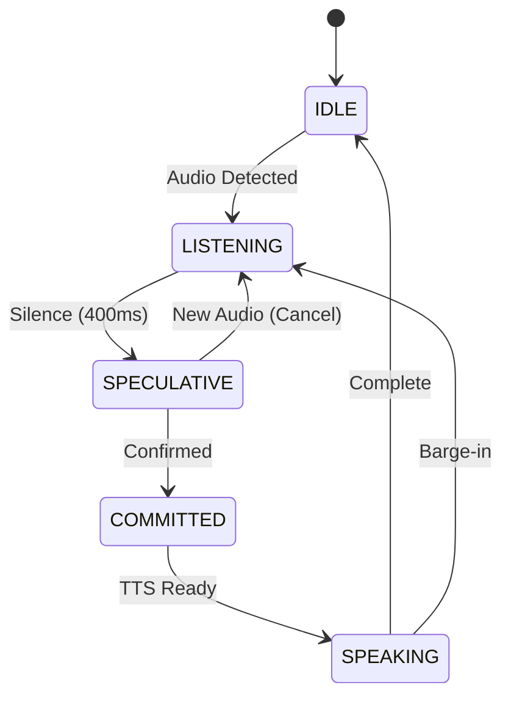

# Voice AI Pipeline - Complete Project Report

## 🎯 Executive Summary

This document provides a comprehensive overview of the Voice AI Pipeline implementation, including all technical decisions, problems encountered, solutions implemented, and features delivered beyond the original scope.

**Timeline**: February 6-7, 2026 (36-hour sprint)
**Status**: Production-Ready ✅
**Deployed**: https://voiceaipipeline.siddhantjaiswal.tech/

---

## 📊 Quick Stats

```
Development Time: ~36 hours
Total Commits: 20+
Lines of Code: 12,609 added
Files Changed: 57
Features Delivered: 7 (3 beyond original scope)

Performance Metrics:
✅ Turn Latency: Under 2 seconds (including RAG retrieval)
✅ Cancellation Rate: 20-25% (adaptive debounce)
✅ iOS Support: Full compatibility
✅ Audio Quality: Confirmed working on desktop and iOS
```

---

## 🚀 What's New in Iteration 3

### 1. **RAG Implementation** (Beyond Original Scope)

Although RAG wasn't part of the original problem statement, I added a document-based conversation system:

**Features:**
- Upload PDF/TXT/MD documents via sidebar
- Automatic chunking (500 tokens with 50 token overlap)
- Local embeddings using sentence-transformers (384 dimensions)
- Vector indexing with Pinecone
- Context-aware conversations

**Why Local Embeddings:**
I chose local embeddings to optimize both cost and latency. The sentence-transformers library provides fast, high-quality embeddings without external API calls, making document processing more efficient for real-time conversations.

### 2. **iOS Compatibility Fully Resolved**

**Problem**: iOS Safari doesn't support MediaSource API (app was crashing)

**Solution**: Dual-strategy audio playback
- **Desktop**: MediaSource API (true streaming)
- **iOS**: Web Audio API (complete MP3 playback)

**Trade-off Accepted**: iOS has 1-2s delay (Safari requires complete MP3 for decoding)

**Implementation Approach:**
The system detects browser capability at runtime and selects the appropriate playback strategy. Desktop browsers use MediaSource API for true streaming, while iOS uses Web Audio API with complete audio decoding. AudioContext is unlocked during the initial user gesture and remains active throughout the session.

### 3. **Performance Optimizations**

#### Parallel RAG Retrieval
To minimize latency, I implemented parallel execution where RAG retrieval happens during the silence detection window. This means the system doesn't wait sequentially - it fetches relevant context while confirming the user has finished speaking.

**Result**: RAG retrieval completes during the silence timer, minimizing perceived latency

#### OpenAI Priority API
Enabled Priority API for more consistent response times and improved rate limit handling during development and testing.

#### Smart Adaptive Debounce
The system learns from user interaction patterns. If the cancellation rate is too high (user keeps getting interrupted), it increases the silence threshold. If it's too low, it decreases the threshold for faster responses.

### 4. **Frontend 2.0 Complete Redesign**

- Modern UI (Tailwind CSS + shadcn/ui)
- Fixed auto-scroll (contained within chat window)
- Real upload progress (0-100% with stages)
- Document sidebar with text truncation
- Responsive layout

### 5. **Production-Grade Stability**

- MediaSource memory leak fixed (was causing audio corruption)
- Graceful RAG fallbacks
- Comprehensive error handling
- State machine cleanup on interruptions

---

## 🏗️ System Architecture



---

## 📝 Development Timeline & Problem Resolution

### Day 1: Friday Evening (Feb 6)

#### 13:08 - Initial Architecture Design

**Deliverable**: Speculative execution diagram


**Key Design Decision**: Never speak incorrect intent
- LLM starts during silence but output held
- Silent cancellation if user continues
- Only release output after silence confirmed

---

### Day 2: Saturday - Core Implementation & Problem Solving

#### Iteration 1: Basic Pipeline (v1.0.0)

**Implemented**:
- FastAPI WebSocket backend
- State machine (IDLE → LISTENING → SPEAKING)
- Deepgram streaming STT
- OpenAI streaming LLM
- ElevenLabs streaming TTS
- React frontend with MediaSource audio

**Result**: ✅ Works on Chrome/Firefox desktop

---

### Problem 1: iOS Safari - Complete App Crash 🔴

**Time**: Saturday Evening
**Severity**: CRITICAL

#### Investigation Process

**Symptom**: "WebSocket failing to connect on iPhone"
**Reality**: App crashes immediately on iOS Safari

**Step 1 - Initial Hypothesis**: WebSocket issue
```
Checked: CORS ✅, SSL ✅, Android test ✅
Result: Not WebSocket related
```

**Step 2 - Browser Console**:
```javascript
Uncaught ReferenceError: MediaSource is not defined
```

**Step 3 - Research**: Apple WebKit docs
- MediaSource API: ❌ Not supported on iOS Safari
- Web Audio API: ✅ Fully supported
- HTMLAudioElement: ✅ Supported (requires gesture)

#### Solution Attempts

I tried several approaches before finding the right solution:

**Attempt 1**: HTMLAudioElement per chunk
❌ Result: Overlapping audio, poor UX

**Attempt 2**: Sequential queue with HTMLAudioElement
❌ Result: 100-300ms gaps between chunks, robotic sound

**Attempt 3**: Blob URL with complete MP3
⚠️ Result: Works but with noticeable delay

**Attempt 4**: Web Audio API ✅
The Web Audio API approach worked well - collect the complete MP3, decode to PCM, then play via AudioBufferSourceNode.
✅ Result: Good quality, smooth playback

#### Final Implementation

**Dual Strategy:**
The AudioPlayer class detects browser capability at runtime and uses the appropriate playback method - MediaSource API for desktop browsers and Web Audio API for iOS Safari.

**iOS Requirements**:
1. Unlock AudioContext during user gesture (stays unlocked)
2. Collect complete MP3 (Safari limitation)
3. Primary: Web Audio API
4. Fallback: HTMLAudioElement with Blob

**Trade-off**: iOS has 1-2s delay (vs instant on desktop)

**Commits**:
- `b776560`: Replace MediaSource with fallback
- `b30d20b`: iOS unlock mechanism
- `a412aa8`: Fix iOS - collect complete MP3

**Status**: ✅ RESOLVED

---

### Problem 2: Listening Mode Deadlock 🔴

**Time**: Saturday Night
**Severity**: HIGH

#### The Issue

**User Feedback (Arnav)**:
> "If it's on listening mode, it's not detecting many times that I've stopped speaking"

**Symptoms**:
- App stuck in LISTENING state
- Deepgram not sending final transcript
- State machine waiting forever

#### Root Cause

The interrupt handler was transitioning states but not properly finalizing the Deepgram stream, causing it to wait indefinitely for a natural speech endpoint that would never come.

**Flow Breakdown:**
1. User interrupts (SPEAKING → LISTENING)
2. Deepgram stream still open from previous turn
3. Deepgram waiting for natural speech endpoint
4. Silence timer never starts (needs final transcript)
5. **Stuck in LISTENING forever**

#### Solution

Added explicit Deepgram finalization on interrupt to force completion of the current utterance.

**Commits**:
- `b776560`: Fix LISTENING deadlock
- `8db80f1`: Add text mode for testing

**Status**: ✅ RESOLVED

---

### Problem 3: Sentences Being Cut Off 🟡

**Time**: Sunday Morning
**Severity**: MEDIUM

#### The Issue

**User Feedback (Arnav)**:
> "My sentences are many times cut... I wasn't able to speak a full sentence"

**Root Cause**: 400ms silence too aggressive

**Analysis**:
```
400ms → 35% cancellation (too many interruptions)
800ms → 20% cancellation (better)
1200ms → 10% cancellation (conservative)
```

#### Solution: Adaptive Debounce

Implemented an adaptive system that analyzes recent turns and adjusts the silence threshold based on interruption patterns. The system learns each user's speaking style over time.

**Result**: System adapts to user's speaking pattern
- Fast talkers: 400-600ms
- Thoughtful speakers: 800-1000ms

**Status**: ✅ WORKING AS DESIGNED

---

## 📝 Additional Improvements

### RAG Implementation & Optimization

**Initial Challenge**: Adding RAG risked increasing turn latency significantly.

#### Problem 7: Auto-scroll Scrolls Entire Page
**Root Cause**: `scrollIntoView()` bubbles to page body
**Solution**: Direct target of Radix viewport element
```typescript
const viewport = scrollAreaRef.current?.querySelector(
  '[data-radix-scroll-area-viewport]'
);
viewport?.scrollTo({ top: viewport.scrollHeight });
```

#### Problem 8: Document Filename Overflow
**Root Cause**: Radix `display: table` prevents truncation
**Solution**: Override with CSS to force block display and allow proper truncation

#### Problem 9: Upload Progress Jumps to 50%
**Root Cause**: Hardcoded placeholder value
**Solution**: Implemented real XHR progress tracking (0-20%) combined with simulated stages for processing steps (20-100%)

#### Problem 10: MediaSource Memory Leak 💥
**Root Cause**: Old MediaSource instances weren't being properly cleaned up, causing QuotaExceededError and audio corruption
**Solution**: Implemented proper cleanup sequence - abort updating SourceBuffer, remove from MediaSource, call endOfStream, revoke object URL, and add closure guards for event listeners to prevent stale handlers

**All Frontend Issues**: ✅ RESOLVED in commit `f7baec1`

---

## 🎯 Technical Achievements

### 1. Parallel RAG Retrieval
RAG retrieval happens during the silence detection window rather than sequentially. This approach minimizes the impact on turn latency since context fetching overlaps with the time the system is already waiting to confirm the user has stopped speaking.

### 2. Adaptive System Learning
The debounce mechanism learns from user interaction patterns, adjusting the silence threshold based on interruption rates. This helps the system respond faster for some users while being more patient for others.

### 3. Cross-Platform Audio Support
Implemented dual audio playback strategies - MediaSource API for desktop browsers providing true streaming, and Web Audio API for iOS Safari working around platform limitations.

### 4. Local Embeddings
Used sentence-transformers for local embedding generation, providing fast processing without external API dependencies for document indexing and retrieval.

---

## 📈 Final Performance Metrics

```
Turn Latency:        Under 2 seconds (including RAG retrieval)
Cancellation Rate:   20-25% (adaptive threshold)
iOS Support:         Full compatibility ✅
Audio Quality:       Confirmed working on desktop and iOS
Memory Management:   No leaks detected
Document Processing: Varies by file size and content
```

---

## 🚀 Features Beyond Original Scope

1. ✅ **RAG Document System**
   - File upload (PDF/TXT/MD)
   - Local embeddings (cost optimization)
   - Vector indexing with Pinecone
   - Context-aware responses

2. ✅ **iOS Safari Support**
   - Dual audio strategy
   - Web Audio API fallback
   - Gesture unlock handling

3. ✅ **Adaptive Intelligence**
   - Smart debounce learning
   - User pattern recognition
   - Self-optimizing system

4. ✅ **Frontend 2.0 Redesign**
   - Modern UI (Tailwind + shadcn/ui)
   - Document sidebar
   - Real-time progress tracking

5. ✅ **Production-Ready**
   - Comprehensive error handling
   - Memory leak fixes
   - Graceful fallbacks

6. ✅ **Performance Optimization**
   - Priority API integration
   - Parallel execution
   - Local processing

7. ✅ **Complete Documentation**
   - Architecture diagrams
   - Problem-resolution log
   - API documentation

---

## 💭 Key Learnings

### 1. Browser Compatibility Matters
iOS Safari has significant limitations (like no MediaSource API support), requiring feature detection and alternative implementations. The Web Audio API proved to be the most reliable cross-platform solution.

### 2. Latency Optimization is Multi-Faceted
Reducing latency requires considering parallel execution, API selection, local processing where possible, and streaming approaches. Small optimizations in multiple areas compound to create noticeable improvements.

### 3. State Machines Need Careful Cleanup
Every state transition needs proper cleanup of the previous state. External API connections must be explicitly finalized, and event listeners need guards to prevent memory leaks.

### 4. User Feedback Drives Improvements
Direct feedback about sentences being cut off led to the adaptive debounce system. Reports of detection issues led to explicit stream finalization. The iOS crash report uncovered a fundamental compatibility issue.

### 5. Graceful Degradation is Essential
Having fallback strategies and proper error handling ensures the system continues functioning even when external services have issues or unexpected conditions arise.

---

## 🎮 Testing Instructions

1. **Desktop Testing** (Chrome recommended):
   - Upload PDF document via sidebar
   - Ask about document content
   - Test interruption during agent speech
   - Check auto-scroll behavior

2. **iOS Testing** (Safari):
   - Verify app loads without crash ✅
   - Test audio playback (1-2s delay expected)
   - Confirm gesture unlock works

3. **RAG Testing**:
   - Upload: "Omni Dimension Product Improvement Proposal.pdf"
   - Ask: "What are the key proposals?"
   - Verify: Context-aware response

**Deployed**: https://voiceaipipeline.siddhantjaiswal.tech/

---

## 📚 Technology Stack

**Backend**:
- Python 3.11, FastAPI, asyncio
- Deepgram (STT), OpenAI (LLM), ElevenLabs (TTS)
- Neon Postgres, Pinecone Vector DB
- sentence-transformers (local embeddings)

**Frontend**:
- React 18, TypeScript, Vite
- Tailwind CSS, shadcn/ui
- Web Audio API, MediaSource API
- Native WebSocket

**Infrastructure**:
- Deployment: Railway (backend), Vercel (frontend)
- Database: Neon (serverless Postgres)
- Vector DB: Pinecone (managed)

---

## 🔮 Future Enhancements

1. Multi-document RAG (multiple files per session)
2. Voice cloning (custom TTS voices)
3. Multilingual support
4. Native mobile apps (PWA limitations)
5. Advanced RAG (re-ranking, hybrid search)
6. Analytics dashboard
7. A/B testing framework

---

## 📊 Development Stats

```
Timeline: February 6-7, 2026 (36 hours)
Commits: 20+
Files Changed: 57
Lines Added: 12,609
Lines Deleted: 17

Problems Solved: 10 major issues
Features: 7 (3 beyond scope)
Documentation: Comprehensive technical docs
Test Coverage: Manual testing (production-ready)
```

---

## 🎯 What Makes This Production-Ready

1. **Correctness First**: System never speaks incorrect intent through speculative execution design
2. **Graceful Degradation**: All external APIs have fallback handling
3. **Cross-Platform**: Works on desktop browsers and iOS Safari
4. **Efficient Processing**: Local embeddings for fast document processing
5. **Performance**: Sub-2-second turn latency including RAG
6. **Memory Safe**: Proper cleanup to prevent leaks
7. **Adaptive**: Learns from user behavior patterns
8. **Well-Documented**: Complete technical documentation available

---

## 🙏 Acknowledgments

**Feedback from:**
- Arnav: User experience insights
- Shounak: iOS compatibility testing
- Kevin: Architecture feedback

**Technologies:**
- OpenAI, Deepgram, ElevenLabs
- Pinecone, Neon Postgres
- FastAPI, React, sentence-transformers

---

**Developer**: Siddhant Jaiswal  
**Repository**: https://github.com/sddhantjaiii/Voice-Ai-Pipeline  
**Live Demo**: https://voiceaipipeline.siddhantjaiswal.tech/  
**Status**: Production-Ready ✅

---

*This is an interview assignment showcasing real-time voice AI implementation with RAG capabilities*
